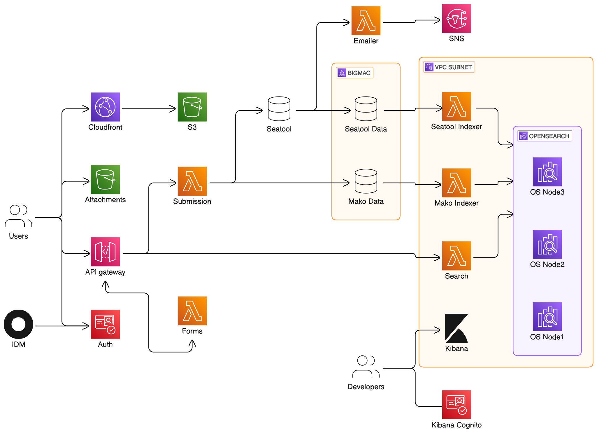

---
### Please visit our [docs site](https://enterprise-cmcs.github.io/macpro-om-template/) for complete documentation.
---

<h1 align="center" style="border-bottom: none;">macpro-base-template</h1>
<h3 align="center">A serverless monorepo accelerator tailored for use at Centers for Medicare & Medicaid Services (CMS).</h3>

  
  
  
  
  
  
  

## Overview

The macpro-om-template project is TBD.

  

## Contributing

Work items for this project are tracked in Jira. Check out the [project kanban board](https://qmacbis.atlassian.net/jira/software/c/projects/OY2/boards/216) to view all work items affecting this repo.

If you don't have access to Jira, would like access to Jira, or would like to drop us an idea without pursuing Jira access, please visit the [slack channel](https://cmsgov.slack.com/archives/C0403M0D007).

## License

See [LICENSE](LICENSE) for full details.
