# OneMAC Complete Techincal Overview

## Executive Summary

OneMAC is a comprehensive state government application that enables state employees to submit new Medicaid waivers, State Plan Amendments (SPAs), and amendments to existing programs. The application serves as a modernized replacement for the legacy OneMAC system, providing a streamlined interface for complex healthcare policy submissions while maintaining integration with existing CMS systems.

**Important Note**: Both state government users and CMS users access the OneMAC application, but with different roles and capabilities. CMS users have read-only access to review submissions, manage user roles, and view package statuses. CMS users also work in SEATool for official status updates, which flow back to OneMAC through BigMAC Kafka topics for data synchronization.

### Key Capabilities

- **New Submissions**: Medicaid SPAs, CHIP SPAs, 1915(b) Waivers, 1915(c) Appendix K Amendments, Temporary Extensions *[Source: `react-app/src/features/forms/new-submission/`, `lib/packages/shared-types/events/`]*
- **Package Management**: Respond to RAI (Request for Additional Information), withdraw packages, upload subsequent documents *[Source: `react-app/src/features/forms/post-submission/`]*
- **User Management**: Role-based access control with state-specific permissions *[Source: `react-app/src/features/user-roles/`, `lib/lambda/user-management/`]*
- **Real-time Data Sync**: Integration with SEATool and legacy OneMAC systems via Kafka event streaming *[Source: `lib/lambda/sinkMain.ts`, `lib/lambda/sinkMainProcessors.ts`]*

## High-Level Architecture Overview

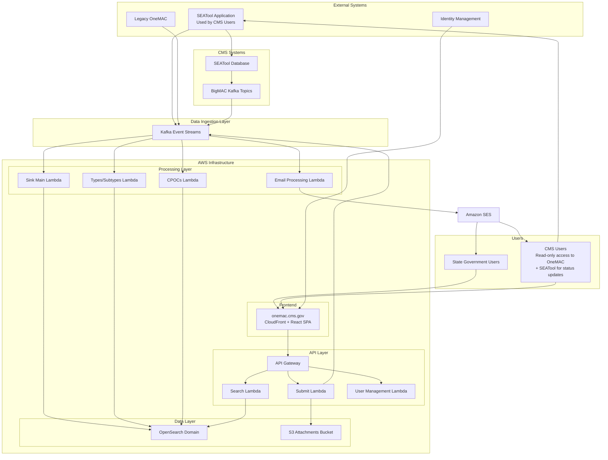

## Technical Architecture

### Core Technology Stack

- **Frontend**: React 18 + TypeScript + Vite + TailwindCSS *[Source: `react-app/package.json`, `react-app/vite.config.ts`]*
- **Backend**: AWS Lambda + Node.js + TypeScript *[Source: `lib/lambda/`, `lib/stacks/api.ts`]*
- **Data Storage**: OpenSearch + S3 *[Source: `lib/stacks/data.ts`, `lib/stacks/uploads.ts`]*
- **Event Streaming**: Apache Kafka *[Source: `lib/lambda/sinkMain.ts`, `.github/workflows/deploy.yml`]*
- **Infrastructure**: AWS CDK + CloudFormation *[Source: `lib/stacks/`, `cdk.json`]*
- **Authentication**: AWS Cognito + IDM Integration *[Source: `lib/stacks/auth.ts`, `lib/stacks/data.ts`]*
- **Testing**: Vitest + Playwright + Storybook *[Source: `test/playwright.config.ts`, `react-app/vitest.storybook.config.ts`]*
- **CI/CD**: GitHub Actions + Semantic Release *[Source: `.github/workflows/`, `package.json`]*

### Data Flow Architecture

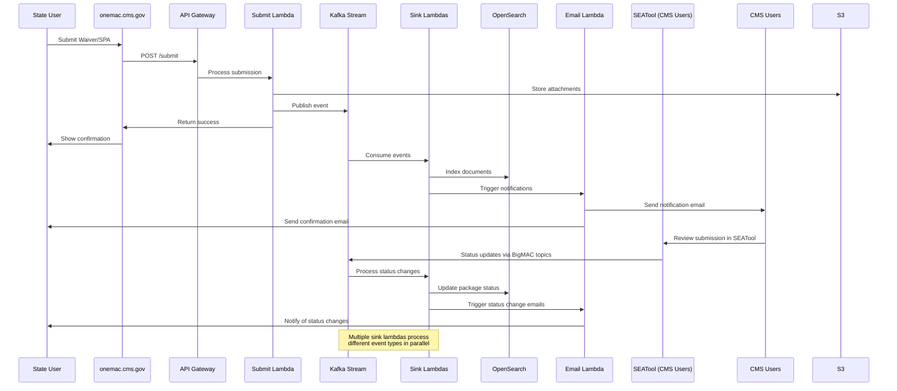

## Data Processing Pipeline

### 1. Event Ingestion (`sinkMain.ts`)

The main data processing pipeline handles three primary Kafka topics *[Source: `lib/lambda/sinkMain.ts` lines 24-31]*:

- **`aws.onemac.migration.cdc`**: New submissions from the OneMAC UI
- **`aws.seatool.ksql.onemac.three.agg.State_Plan`**: SEATool state plan updates (via BigMAC)
- **`aws.seatool.debezium.changed_date.SEA.dbo.State_Plan`**: Date synchronization from SEATool

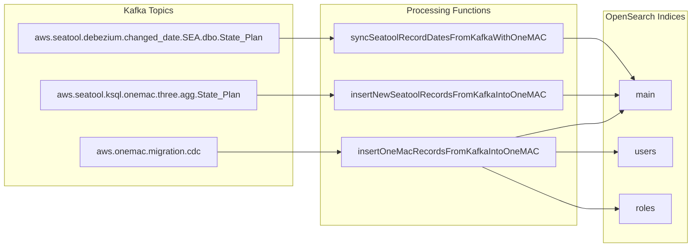

### 2. Data Transformation (`sinkMainProcessors.ts`)

The system handles multiple record types with sophisticated validation and transformation *[Source: `lib/lambda/sinkMainProcessors.ts` lines 121-258]*:

- **OneMAC Records**: New submissions from the current application *[Source: `lib/lambda/sinkMainProcessors.ts` lines 121-127]*
- **Legacy OneMAC Records**: Historical data from the previous system *[Source: `lib/lambda/sinkMainProcessors.ts` lines 107-119]*
- **SEATool Records**: External system data requiring status reconciliation *[Source: `lib/lambda/sinkMainProcessors.ts` lines 442-571]*
- **SEATool Records**: Status updates and review actions from CMS users via BigMAC topics
- **User Records**: Role requests and user information *[Source: `lib/lambda/sinkMainProcessors.ts` lines 61-106]*
- **Admin Changes**: Administrative modifications to existing records *[Source: `lib/lambda/sinkMainProcessors.ts` lines 129-135]*

### 3. Status Reconciliation

A critical feature is the `oneMacSeatoolStatusCheck` function that reconciles status conflicts between OneMAC and SEATool systems *[Source: `lib/lambda/sinkMainProcessors.ts` lines 340-435]*:

- **Withdrawal Requested**: OneMAC takes precedence until SEATool confirms withdrawal *[Source: lines 347-354]*
- **RAI Responses**: Timestamp-based logic determines if responses were submitted before new RAI requests *[Source: lines 375-399]*
- **Status Priority**: OneMAC statuses for withdrawal and RAI responses override SEATool statuses *[Source: lines 411-431]*
- **SEATool Integration**: Status updates from CMS users in SEATool flow through BigMAC topics

## OpenSearch Architecture

### Index Structure

The application maintains multiple OpenSearch indices *[Source: `lib/lambda/setupIndex.ts` lines 13-54]*:

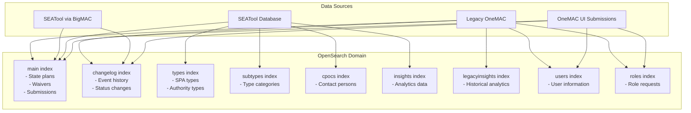

### Search Functionality (`search.ts`)

The search API provides filtered access based on user permissions *[Source: `lib/lambda/search.ts`]*:

- **State Filtering**: Users only see records for their authorized states *[Source: lines 39-42]*
- **Origin Filtering**: Returns OneMAC records and NOSO events from SEATool *[Source: lines 44-58]*
- **Soft Delete Handling**: Excludes deleted records *[Source: line 37]*
- **AppK Children**: Automatically fetches related Appendix K child records *[Source: lines 63-70]*

## Frontend Architecture

### React Application Structure

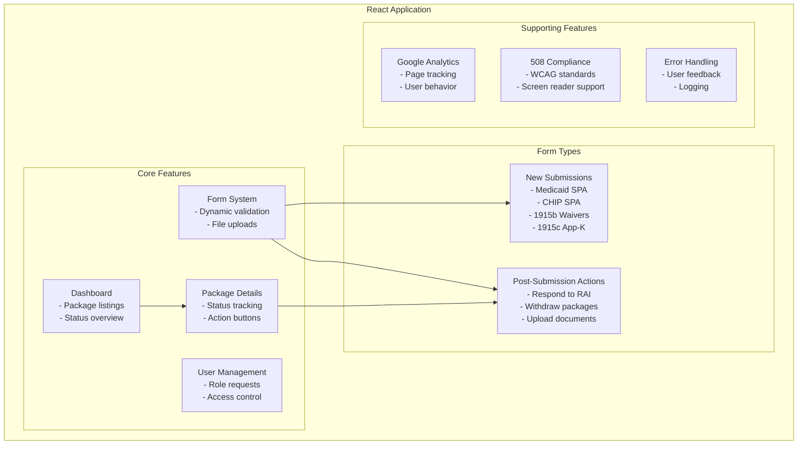

### Form System

The application uses a sophisticated form system with *[Source: `react-app/src/features/forms/`, `react-app/src/formSchemas/`]*:

- **Dynamic Schema Validation**: Zod schemas for type-safe validation *[Source: `react-app/src/formSchemas/`]*
- **Conditional Fields**: Fields that appear/disappear based on selections *[Source: `react-app/src/features/forms/new-submission/`]*
- **File Upload Management**: Secure S3 uploads with virus scanning *[Source: `lib/local-constructs/clamav-scanning/`]*
- **Real-time Validation**: Client-side and server-side validation *[Source: `react-app/src/components/ActionForm/`]*
- **Accessibility**: Full 508 compliance with screen reader support *[Source: `react-app/.storybook/preview.tsx` lines 39-42]*

## Email Notification System

### Email Templates and Triggers

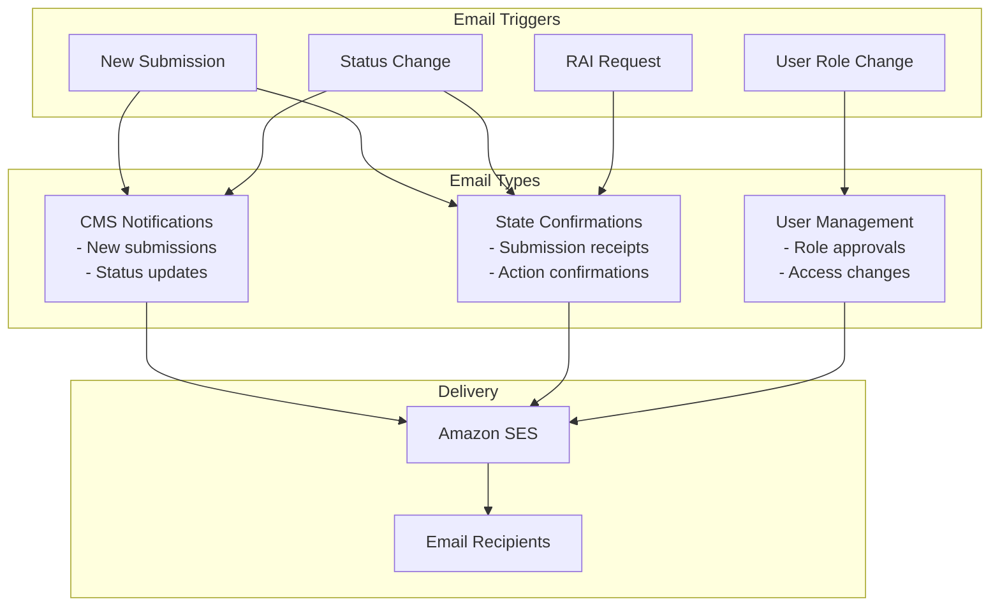

### Email Content Management

- **React Email Templates**: Type-safe email templates using React components *[Source: `lib/libs/email/content/`, `lib/libs/email/preview/`]*
- **Authority-Specific Content**: Different templates for different waiver/SPA types *[Source: `lib/libs/email/index.ts` lines 48-69]*
- **Dynamic Content**: Variables populated from submission data *[Source: `lib/libs/email/content/newSubmission/index.tsx`]*
- **Attachment Listings**: Automatic inclusion of uploaded documents *[Source: email template files in `lib/libs/email/preview/`]*

## Legacy System Integration

### OneMAC Migration Strategy

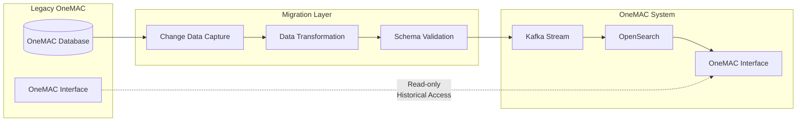

### SEATool Integration

SEATool provides authoritative data for *[Source: `lib/lambda/sinkTypes.ts`, `lib/lambda/sinkSubtypes.ts`, `lib/lambda/sinkCpocs.ts`]*:

- **State Plan Types**: Available submission types per state *[Source: `lib/lambda/getTypes.ts`, `lib/lambda/sinkTypes.ts`]*
- **Contact Information**: State and CMS contact persons (CPOCs) *[Source: `lib/lambda/getCpocs.ts`, `lib/lambda/sinkCpocs.ts`]*
- **Status Updates**: Official CMS review statuses *[Source: `lib/lambda/sinkMainProcessors.ts` lines 340-435]*
- **Reference Data**: Authorities, types, and subtypes *[Source: `lib/lambda/getSubTypes.ts`, `lib/lambda/sinkSubtypes.ts`]*

## Testing Strategy

### Multi-Layered Testing Approach

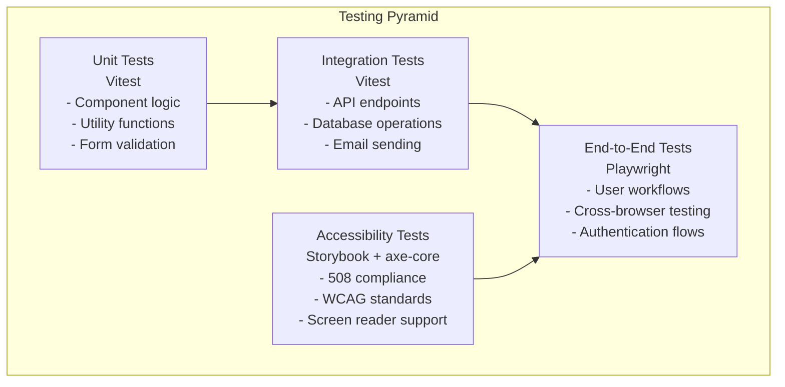

### 508 Accessibility Compliance

The application ensures full accessibility compliance through *[Source: `react-app/.storybook/`, `.github/workflows/a11y.yml`]*:

- **Automated Testing**: Storybook integration with axe-core for automated accessibility testing *[Source: `react-app/.storybook/vitest.setup.ts`, `react-app/vitest.storybook.config.ts`]*
- **Manual Testing**: Screen reader compatibility testing *[Source: `test/` Playwright tests]*
- **WCAG 2.1 AA Standards**: Full compliance with federal accessibility requirements *[Source: `react-app/.storybook/preview.tsx` lines 39-42]*
- **Continuous Monitoring**: Accessibility tests run on every build *[Source: `.github/workflows/a11y.yml`]*

### Test Environments

- **Local**: Development environment with mocked services *[Source: `test/playwright.config.ts` lines 100-106]*
- **CI**: Automated testing environment for pull requests *[Source: `test/playwright.config.ts` lines 108-114]*
- **Val**: Validation environment for pre-production testing *[Source: `test/playwright.config.ts` lines 116-122]*
- **Production**: Smoke tests on live environment *[Source: `test/playwright.config.ts` lines 140-146, `test/e2e/smoke/`]*

## CI/CD Pipeline

### GitHub Actions Workflow

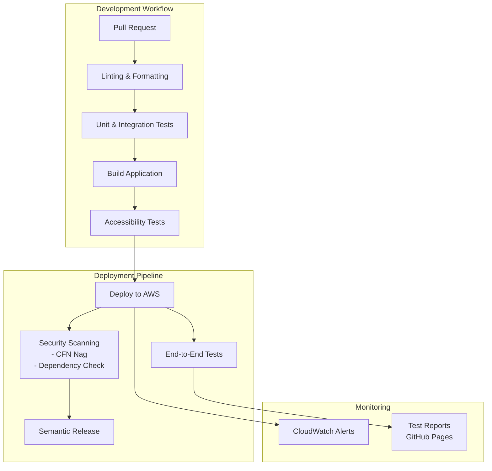

### Deployment Strategy

- **Branch-based Deployments**: Each branch gets its own AWS environment *[Source: `.github/workflows/deploy.yml` lines 9-14]*
- **Infrastructure as Code**: Full AWS infrastructure defined in CDK *[Source: `lib/stacks/`, `cdk.json`]*
- **Automated Testing**: Comprehensive test suite runs on every deployment *[Source: `.github/workflows/deploy.yml` lines 113-181]*
- **Security Scanning**: CloudFormation templates scanned for security issues *[Source: `.github/workflows/deploy.yml` lines 196-226]*

## User Roles and Permissions

### Role-Based Access Control

*[Source: `lib/packages/shared-types/user.ts` lines 53-77, `lib/packages/shared-utils/user-helper.ts` lines 90-110]*

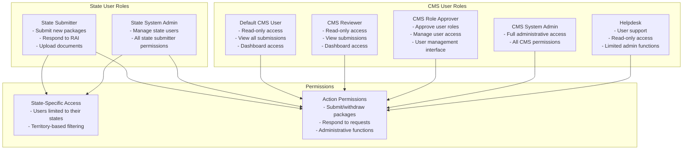

### CMS User Capabilities in OneMAC

*[Source: `lib/packages/shared-types/user.ts`, `react-app/src/features/dashboard/`, `react-app/src/features/user-roles/`]*

**What CMS Users Can Do:**

- **Dashboard Access**: View all state submissions across all states *[Source: `react-app/src/features/dashboard/index.test.tsx` lines 231-275]*
- **Package Review**: Read-only access to submission details, attachments, and status history
- **User Management**: CMS Role Approvers can approve/deny state user access requests *[Source: `react-app/src/components/Layout/index.tsx` lines 62-67]*
- **Cross-State Visibility**: Unlike state users, CMS users can see submissions from all states
- **Role Administration**: System admins and role approvers can manage user permissions

**What CMS Users Cannot Do:**

- **Submit New Packages**: Only state users can create new submissions
- **Respond to RAI**: Cannot respond to requests for additional information
- **Upload Documents**: Cannot upload subsequent documents or make changes
- **Withdraw Packages**: Cannot initiate package withdrawals

**CMS Role Hierarchy** *[Source: `lib/packages/shared-utils/user-helper.ts` lines 76-88]*:

- **defaultcmsuser/cmsreviewer**: Basic read-only access
- **cmsroleapprover**: Can approve state system admin requests
- **systemadmin**: Can approve all role types including helpdesk and cmsroleapprover
- **helpdesk**: User support with read-only access

## Package Lifecycle

### Submission to Approval Flow

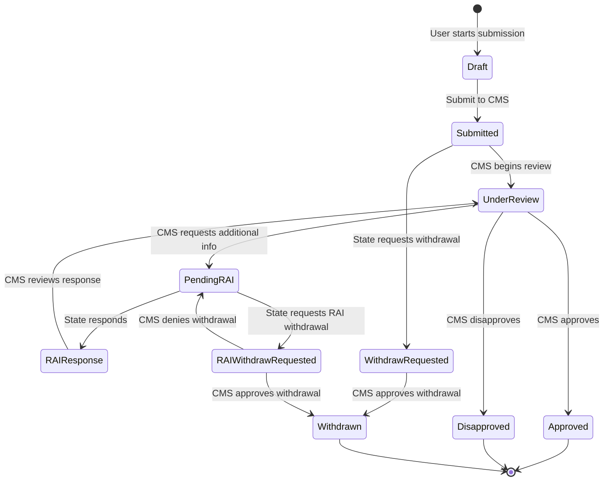

### Package Types and Authorities

The system supports multiple submission types *[Source: `react-app/src/features/forms/`, `lib/packages/shared-types/events/`]*:

#### State Plan Amendments (SPAs)

- **Medicaid SPA**: Standard Medicaid state plan amendments *[Source: `react-app/src/features/forms/new-submission/Medicaid.tsx`]*
- **CHIP SPA**: Children's Health Insurance Program amendments *[Source: `react-app/src/features/forms/new-submission/Chip.tsx`]*
- **CHIP Eligibility SPA**: CHIP eligibility-specific amendments *[Source: `react-app/src/features/forms/new-submission/ChipDetails.tsx`]*

#### Waivers

- **1915(b) Comprehensive Capitated**: Managed care waivers *[Source: `react-app/src/features/forms/waiver/capitated/`]*
- **1915(b) Comprehensive Contracting**: Fee-for-service selective contracting *[Source: `react-app/src/features/forms/waiver/contracting/`]*
- **1915(c) Appendix K**: Home and community-based services amendments *[Source: `react-app/src/features/forms/waiver/app-k/`]*
- **Temporary Extensions**: Short-term waiver extensions *[Source: `react-app/src/features/forms/waiver/temporary-extension/`]*

## Google Analytics Integration

### User Behavior Tracking

The application implements comprehensive analytics through `PathTracker.tsx` *[Source: `react-app/src/utils/ReactGA/PathTracker.tsx`]*:

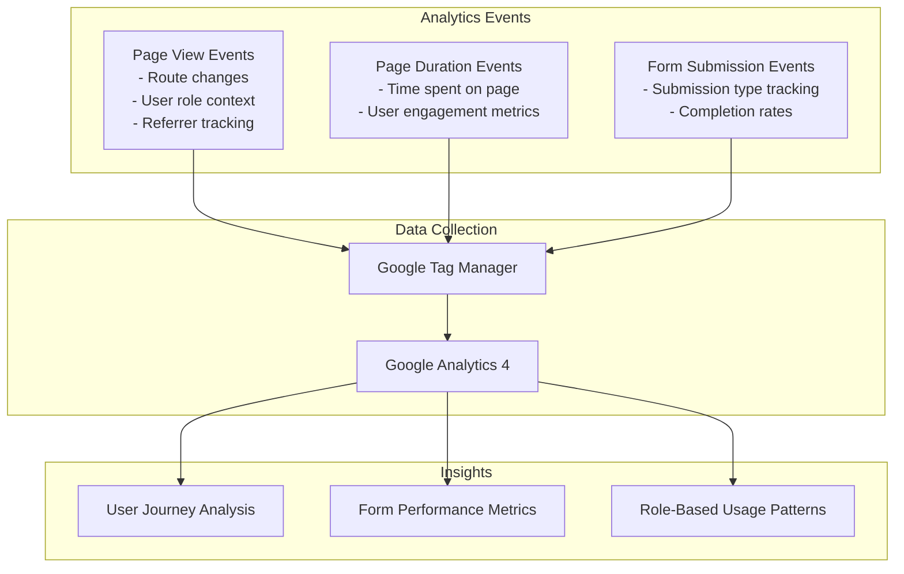

### Analytics Implementation

- **Automatic Page Tracking**: Route changes automatically tracked *[Source: `react-app/src/utils/ReactGA/PathTracker.tsx` lines 52-70]*
- **User Role Context**: All events include user role information *[Source: `react-app/src/utils/ReactGA/PathTracker.tsx` lines 27-31, 40-44]*
- **Form-Specific Tracking**: Different submission types tracked separately *[Source: `react-app/src/utils/ReactGA/Mapper.tsx`]*
- **Performance Monitoring**: Page load times and user engagement metrics *[Source: `react-app/src/utils/ReactGA/PathTracker.tsx` lines 35-46]*

## Development Workflow

### Local Development Setup

1. **Prerequisites**: Node.js, Bun, direnv, AWS CLI *[Source: `run` script lines 8-30]*
2. **Environment Setup**: `.envrc` file with AWS credentials and environment variables *[Source: project memory about direnv usage]*
3. **Database Setup**: Local OpenSearch instance or connection to shared environment *[Source: `lib/stacks/data.ts`]*
4. **Service Dependencies**: Kafka topics and external service mocks *[Source: `mocks/` directory]*

### Development Commands

```bash
# Install dependencies
run install

# Start local development
run ui

# Run tests
run test

# Run end-to-end tests
run e2e

# Deploy to AWS
run deploy --stage <branch-name>

# View logs
run logs

# Open application
run open-app

# View Kibana dashboard
run open-kibana
```

*[Source: `bin/cli/src/run.ts`, `bin/cli/src/commands/`]*

## Monitoring and Observability

### CloudWatch Integration

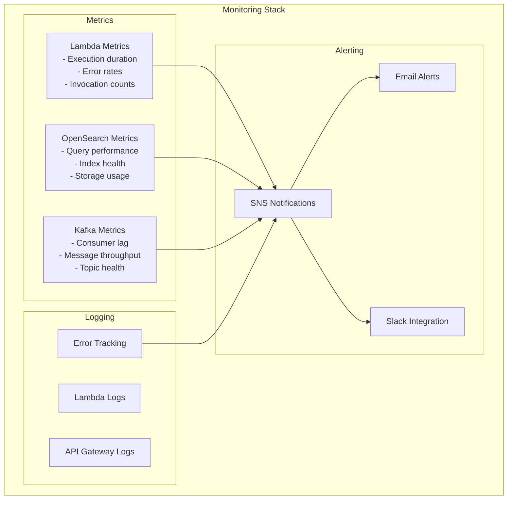

### Error Handling Strategy

- **Structured Logging**: Consistent error logging with context *[Source: `lib/libs/sink-lib.ts`, `lib/lambda/sinkMainProcessors.ts` error handling]*
- **Dead Letter Queues**: Failed Kafka messages routed to DLQ for investigation *[Source: `lib/stacks/email.ts` lines 247-252]*
- **Graceful Degradation**: Application continues functioning during partial failures *[Source: `lib/lambda/sinkMainProcessors.ts` validation and error handling]*
- **Automatic Retries**: Built-in retry logic for transient failures *[Source: Lambda function configurations in `lib/stacks/`]*

## Security Architecture

### Authentication and Authorization

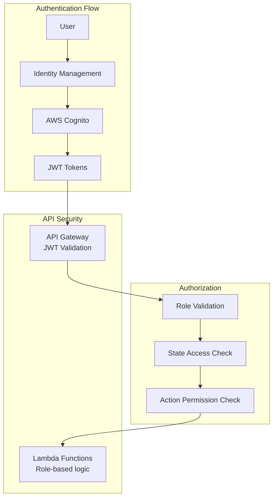

### Data Security

- **Encryption at Rest**: All data encrypted in OpenSearch and S3 *[Source: `lib/stacks/data.ts` lines 178-183, `lib/stacks/uploads.ts`]*
- **Encryption in Transit**: TLS 1.2+ for all communications *[Source: `lib/stacks/data.ts` lines 180-183]*
- **VPC Isolation**: Lambda functions run in private subnets *[Source: `lib/stacks/api.ts`, `lib/stacks/data.ts` VPC configurations]*
- **IAM Least Privilege**: Minimal required permissions for each service *[Source: `lib/stacks/api.ts` IAM role definitions]*
- **Virus Scanning**: All uploaded files scanned before storage *[Source: `lib/local-constructs/clamav-scanning/`]*

## Performance Considerations

### Optimization Strategies

1. **Parallel Processing**: Kafka events processed in parallel across multiple Lambda functions *[Source: `lib/lambda/sinkMain.ts` lines 17-38]*
2. **Batch Operations**: Bulk updates to OpenSearch for efficiency *[Source: `lib/libs/sink-lib.ts` bulkUpdateDataWrapper]*
3. **Caching**: CloudFront caching for static assets *[Source: `lib/stacks/ui-infra.ts`]*
4. **Connection Pooling**: Reused connections to OpenSearch *[Source: `lib/libs/opensearch-lib.ts`]*
5. **Lazy Loading**: Frontend components loaded on demand *[Source: `react-app/src/` component structure]*

### Scalability Features

- **Auto-scaling Lambda**: Functions scale automatically with load *[Source: AWS Lambda default behavior, `lib/stacks/api.ts` Lambda configurations]*
- **OpenSearch Scaling**: Multi-AZ deployment with auto-scaling *[Source: `lib/stacks/data.ts` lines 171-177]*
- **CDN Distribution**: Global content delivery via CloudFront *[Source: `lib/stacks/ui-infra.ts`]*
- **Kafka Partitioning**: Events distributed across multiple partitions *[Source: Kafka topic configurations in `lib/stacks/data.ts`]*

## Operational Procedures

### Deployment Process

1. **Feature Development**: Work on feature branch *[Source: Git workflow]*
2. **Pull Request**: Automated testing and review *[Source: `.github/workflows/deploy.yml` lines 32-44]*
3. **Branch Deployment**: Automatic deployment to AWS environment *[Source: `.github/workflows/deploy.yml` lines 45-88]*
4. **End-to-End Testing**: Automated Playwright tests *[Source: `.github/workflows/deploy.yml` lines 113-181]*
5. **Security Scanning**: CloudFormation template security analysis *[Source: `.github/workflows/deploy.yml` lines 196-226]*
6. **Merge to Main**: Production deployment via semantic release *[Source: `.github/workflows/deploy.yml` lines 265-282, `package.json` lines 92-105]*

### Monitoring and Maintenance

- **Daily Health Checks**: Automated monitoring of key metrics *[Source: CloudWatch configurations in `lib/stacks/`]*
- **Consumer Lag Monitoring**: Kafka consumer lag alerts *[Source: `lib/lambda/checkConsumerLag.ts`, `lib/stacks/data.ts` Step Functions]*
- **Error Rate Monitoring**: Lambda function error rate tracking *[Source: `lib/stacks/email.ts` lines 283-290]*
- **Performance Monitoring**: Response time and throughput metrics *[Source: CloudWatch metrics in stack configurations]*

### Disaster Recovery

- **Multi-AZ Deployment**: High availability across availability zones *[Source: `lib/stacks/data.ts` lines 175-177]*
- **Automated Backups**: OpenSearch snapshots and S3 versioning *[Source: AWS service defaults]*
- **Infrastructure as Code**: Complete environment recreation via CDK *[Source: `lib/stacks/`, `cdk.json`]*
- **Data Replay**: Kafka event replay capability for data recovery *[Source: `lib/stacks/data.ts` Step Functions lines 554-629]*

## Step Functions Workflow

### Event Replay System

OneMAC includes a sophisticated Step Functions workflow for replaying Kafka events *[Source: `lib/stacks/data.ts` lines 554-629]*:

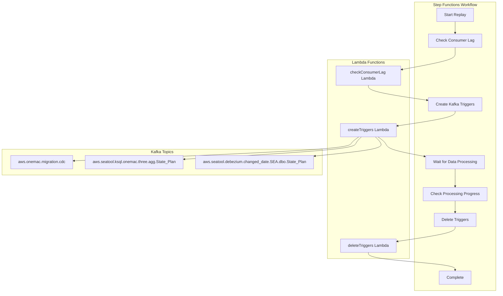

### Replay Capabilities

The Step Functions workflow enables:

- **Historical Data Replay**: Replay events from specific timestamps *[Source: `lib/lambda/checkConsumerLag.ts`]*
- **Selective Topic Replay**: Choose which Kafka topics to replay *[Source: `lib/stacks/data.ts` lines 576-623]*
- **Progress Monitoring**: Track replay progress and consumer lag *[Source: `lib/lambda/checkConsumerLag.ts`]*
- **Automatic Cleanup**: Remove temporary triggers after replay completion *[Source: `lib/lambda/deleteTriggers.ts`]*

## Human Intervention Points

### Required Manual Processes

1. **User Role Approval**: CMS role approvers must manually approve state user access requests (via SEATool)
2. **RAI Review**: CMS reviewers manually review submissions and create RAI requests in SEATool
3. **Package Approval**: Final CMS approval requires human review and decision in SEATool
4. **Incident Response**: Manual intervention required for system alerts and failures
5. **Configuration Changes**: Environment-specific configuration updates

### Automated Processes

- **Data Synchronization**: Automatic sync between OneMAC, SEATool, and SEATool via BigMAC
- **Email Notifications**: Automatic email triggers for status changes
- **Status Updates**: Automatic status reconciliation between systems
- **File Processing**: Automatic virus scanning and file validation
- **Index Management**: Automatic OpenSearch index creation and mapping updates

## SEATool Integration

### CMS Workflow via SEATool

CMS users interact with OneMAC submissions through a separate application called **SEATool**:

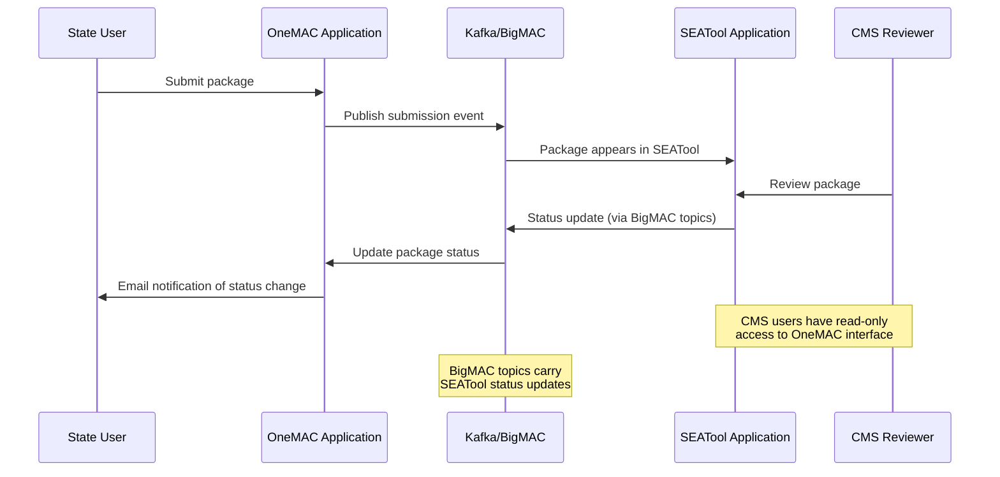

### SEATool Responsibilities

- **Package Review**: CMS reviewers examine submissions and supporting documents
- **RAI Creation**: Generate requests for additional information
- **Status Management**: Update package statuses (approve, disapprove, request changes)
- **Communication**: Trigger email notifications back to state users

### BigMAC Topic Integration

BigMAC (the Kafka topic system) carries SEATool updates to OneMAC:

- **Status Changes**: Approval, disapproval, RAI requests
- **Review Comments**: CMS reviewer feedback and notes
- **Workflow Updates**: Package progression through CMS review process

## Data Sources and Integration

### Primary Data Sources

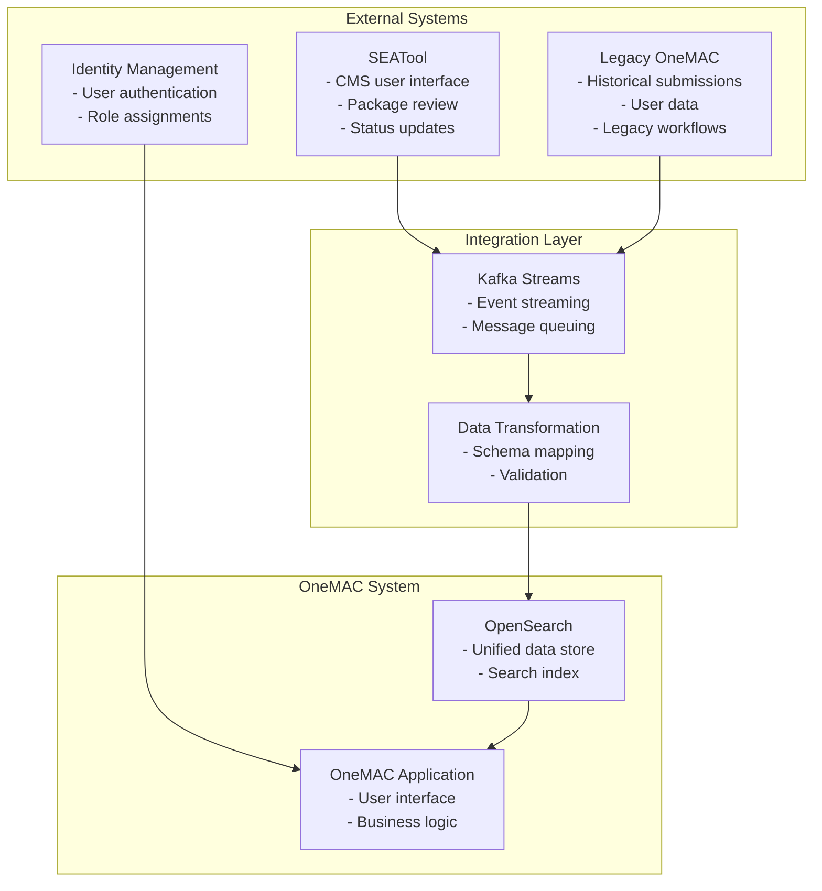

## Quick Start Guide for New Team Members

**What OneMAC Does**: OneMAC is essentially a digital submission portal where state government employees submit healthcare policy documents (Medicaid waivers and state plan amendments) to CMS for approval. Think of it as a sophisticated form system with file uploads, status tracking, and email notifications. State users fill out forms, upload supporting documents, and track their submission status, while CMS users have read-only access to view and review submissions in OneMAC, plus they use SEATool for official status updates.

**How Data Flows**: The application follows an event-driven architecture centered around Kafka message streams. When a state user submits a form through the React frontend, it triggers a Lambda function that stores files in S3 and publishes an event to Kafka. Multiple "sink" Lambda functions consume these Kafka events and index the data into OpenSearch (our search database). When CMS users make decisions in SEATool, those changes also flow through Kafka back to OneMAC, keeping both systems synchronized. Email notifications are automatically triggered at key points in this workflow.

**Technical Structure**: The codebase is organized into clear layers - React frontend (`react-app/`), Lambda backend functions (`lib/lambda/`), AWS infrastructure definitions (`lib/stacks/`), shared TypeScript types (`lib/packages/shared-types/`), and comprehensive tests (`test/`). The infrastructure is defined as code using AWS CDK, and everything deploys automatically through GitHub Actions. Each Git branch gets its own complete AWS environment, making it safe to develop and test features in isolation.

**Key Integration Points**: The most complex part of the system is reconciling data between three sources: new OneMAC submissions, legacy OneMAC historical data, and authoritative SEATool data. The `sinkMainProcessors.ts` file contains the business logic that handles conflicts between these systems - for example, determining whether a OneMAC withdrawal request should override a SEATool status update based on timestamps. Understanding this reconciliation logic is crucial for maintaining data integrity across the entire healthcare policy workflow.

## Glossary and External Resources

### Key Terms and Definitions

**1915(b) Waiver** - Medicaid waiver that allows states to provide services through managed care delivery systems or otherwise limit people's choice of provider.

- *Official Resource*: [CMS 1915(b) Waiver Information](https://www.medicaid.gov/medicaid/section-1115-demonstrations/1915-b-waivers/index.html)

**1915(c) Waiver** - Home and Community-Based Services (HCBS) waiver that allows states to provide long-term care services in home and community settings rather than institutional settings.

- *Official Resource*: [CMS 1915(c) HCBS Waiver Information](https://www.medicaid.gov/medicaid/home-community-based-services/home-community-based-services-authorities/home-community-based-services-1915c/index.html)

**Appendix K** - Special amendment to 1915(c) waivers that allows states to temporarily modify waiver services during emergencies (like COVID-19).

- *Official Resource*: [CMS Appendix K Emergency Authority](https://www.medicaid.gov/state-resource-center/downloads/covid-19-appendix-k-template.pdf)

**CHIP SPA** - Children's Health Insurance Program State Plan Amendment, modifications to state CHIP programs.

- *Official Resource*: [CMS CHIP Information](https://www.medicaid.gov/chip/index.html)

**Medicaid SPA** - State Plan Amendment, formal requests to modify a state's Medicaid program.

- *Official Resource*: [CMS State Plan Amendments](https://www.medicaid.gov/medicaid/medicaid-state-plan-amendments/index.html)

**RAI (Request for Additional Information)** - Formal CMS request for additional documentation or clarification on a submission.

- *Official Resource*: [CMS Review Process Guidelines](https://www.medicaid.gov/medicaid/medicaid-state-plan-amendments/downloads/review-guide.pdf)

**SEATool** - State Electronic Access Tool, CMS's system for reviewing and approving state submissions.

- *Official Resource*: [CMS SEATool User Guide](https://www.medicaid.gov/state-resource-center/medicaid-state-technical-assistance/seatool/index.html)

**CPOC (Central Point of Contact)** - Designated state and CMS contacts for Medicaid/CHIP communications.

- *Official Resource*: [CMS State Contacts Directory](https://www.medicaid.gov/about-us/contact-us/contact-state-page/index.html)

**NOSO (Notice of State Opportunity)** - CMS notification to states about available federal funding or policy opportunities.

### External System References

**BigMAC** - The Kafka topic system that carries data between CMS systems and OneMAC.

**IDM (Identity Management)** - CMS's centralized identity and access management system.

### Regulatory and Compliance Resources

**Section 508 Compliance** - Federal accessibility requirements for electronic and information technology.

- *Official Resource*: [Section 508.gov](https://www.section508.gov/)

**WCAG 2.1 AA** - Web Content Accessibility Guidelines Level AA compliance standards.

- *Official Resource*: [WCAG 2.1 Guidelines](https://www.w3.org/WAI/WCAG21/quickref/)

**HIPAA** - Health Insurance Portability and Accountability Act privacy and security requirements.

- *Official Resource*: [HHS HIPAA Information](https://www.hhs.gov/hipaa/index.html)

### CMS Program Resources

**Medicaid.gov** - Primary resource for Medicaid program information

- *Link*: [https://www.medicaid.gov/](https://www.medicaid.gov/)

**CMS State Resource Center** - Technical assistance and guidance for states

- *Link*: [https://www.medicaid.gov/state-resource-center/index.html](https://www.medicaid.gov/state-resource-center/index.html)

**CMS Waiver List** - Current approved waivers by state

- *Link*: [https://www.medicaid.gov/medicaid/section-1115-demonstrations/index.html](https://www.medicaid.gov/medicaid/section-1115-demonstrations/index.html)

**CHIP Program Information** - Children's Health Insurance Program details

- *Link*: [https://www.medicaid.gov/chip/index.html](https://www.medicaid.gov/chip/index.html)

### Technical Resources

**AWS CDK Documentation** - Infrastructure as Code framework used by OneMAC

- *Link*: [https://docs.aws.amazon.com/cdk/](https://docs.aws.amazon.com/cdk/)

**Apache Kafka Documentation** - Event streaming platform documentation

- *Link*: [https://kafka.apache.org/documentation/](https://kafka.apache.org/documentation/)

**OpenSearch Documentation** - Search and analytics engine documentation

- *Link*: [https://opensearch.org/docs/](https://opensearch.org/docs/)

### Acronym Quick Reference

- **CDC**: Change Data Capture
- **CHIP**: Children's Health Insurance Program  
- **CMS**: Centers for Medicare & Medicaid Services
- **CPOC**: Central Point of Contact
- **DLQ**: Dead Letter Queue
- **HCBS**: Home and Community-Based Services
- **IDM**: Identity Management
- **NOSO**: Notice of State Opportunity
- **RAI**: Request for Additional Information
- **SPA**: State Plan Amendment
- **VPC**: Virtual Private Cloud
